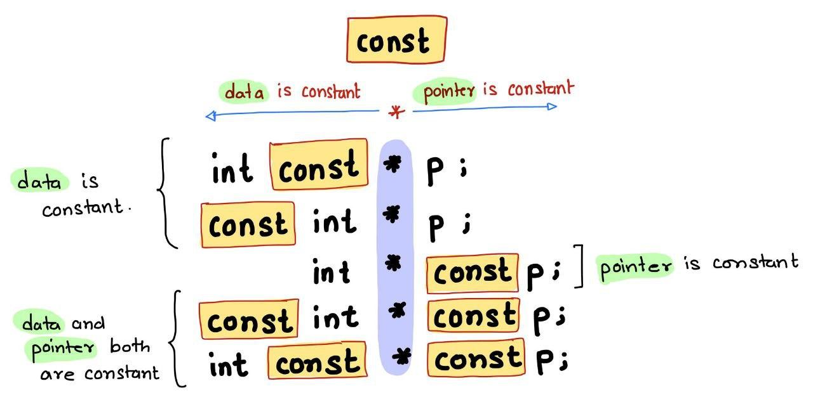

## const keyword in cpp


Variables marked with *const* dont have global linkage. You cannot extern them from external source files.

In C++ *const* variables need to be initialized unlike C.




`const int * var; // low level const`

`int const * var;   // low level const, same meaning as above`

`int * const var; // high level const`

`const int * const var; // both high level and both level const`

**Position of the const keyword related to the * defines whether the the pointer or the target is constant**. 

Rerefences in C++ are high level constants.

You can re-assign low level constants but you cant re-assign high level constants.

`int* const  var ; // Syntax error in Cpp, need to initialize the high-level constant variable. And cant be reassigned.`

`const int* var; // Legal in Cpp, can be reassigned and initialized with garbage value because it is a low level const.`


### Implicit type casting


```
void func(const int* ptr)

{
	int* p = ptr;
}

// Possible in C , syntax error in C++ (possible with const casting)
```


