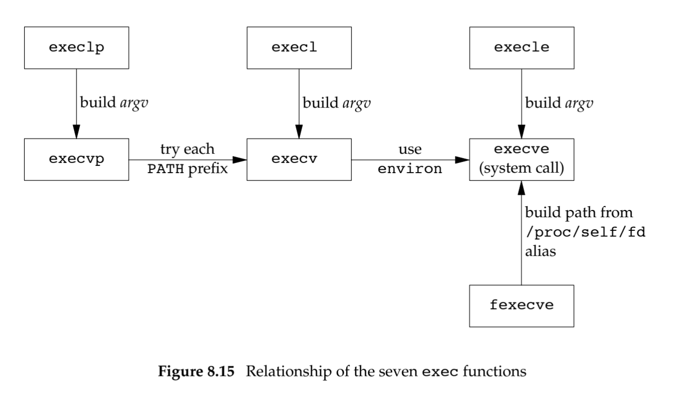

# What Happens When 'ls -a' is run on the terminal ?

Whenever a command is invoked on the terminal, terminal basically forks itself and calls execvp to replace the child process with the copy of the invoked binary.

The `filepath` argument to `execvp()` can take either of two forms — it contains a slash or it does not contain a slash.

### With slash

The `filepath` argument specifies the pathname of the executable, either an absolute name (starts with slash) or a relative name (does not start with slash, but does contain a slash). The `execvp()` function makes no changes to the argument, and the program is executed (or not) assuming that the file named exists and is executable.

### Without slash

The `filepath` arguments specifies a 'simple' name such as `ls`. The `excevp()` function then seeks to execute a program with the name `ls` found in one of the directories listed in the `$PATH` environment variable. The `p` in `execvp()` is for 'path', as in path lookup. `$PATH` variable may consists of many directory paths separated by `:` . execvp parses the columns and  checks each column divided path.

### Applying the theory

If the user types `ls -a` to a shell, the normal way to execute that would be to create an array of character pointers equivalent to:

```c
char *argv[] = { "ls", "-a", 0 };

execvp(argv[0], argv);
```

The `execvp()` will now do the path-based analysis and attempt to execute `ls` from one of the directories listed in `$PATH`.

If the user types `/bin/ls -a` to a shell, then the normal way to execute that would be to create an array of character pointers equivalent to:

```c
char *argv[] = { "/bin/ls", "-a", 0 };

execvp(argv[0], argv);
```

The `execvp()` will now execute the absolute pathname specified, because that's what the user requested (as opposed to, say, `/usr/bin/ls` or `/usr/local/bin/ls`).

Note that the processing is actually the same — you split the command line into words; each word becomes an element of an array of character pointers that is terminated with a null pointer, and you pass the first word to `execvp()` as the 'filepath' argument, and the whole array as the second argument.

Obviously, a shell can cache the locations of the actual executables, and many shells do, so that `execvp()` doesn't have to do work trying to find the program (and the shells don't call `execvp()` but typically call `execv()` with the absolute pathname of the executable. But that isn't necessary; it is an optimization.

Note, too, that there is nothing to stop you doing:

```c
char *argv[] = { "/honky/tonk/toys", "-a", 0 };
execvp("ls", argv);
```

Now `argv[0]` should be `"/honky/tonk/toys"` and not `ls`, for all it is the `ls` executable that is run. What you find in `/proc` depends on you having `/proc` on your system (Mac OS X does not support it, for example), but the symlink to the binary should be a link to `/bin/ls`. On Linux, you're apt to find that `ps` reports the binary name (`ls`), even though `/proc/PID/cmdline` contains the original arguments (so `argv[0]` is `/honky/tonk/toys`). Whether this is good or not depends on your viewpoint, but all the world is not Linux.

### exec family



